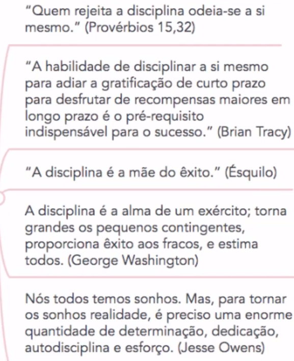

# Como Desenvolver sua Autodisciplina

## Aprofundando a motivação

- Autodisciplina não é força de vontade, é fazer o que deve ser feito independente da sua vontade
- Autodisciplina é mais que um hábito, te mais a ver com gestão que com hábito
- Buscar uma área para aplicar, que servirá de âncora para as demais áreas da vida

Frases importantes:

- Sábio é quem faz, não quem sabe -> O conteúdo deve virar aplicação

## Ideias Importantes

- Autodisciplina é uma competência, deve ser treinada, cultivada
- Ninguém é autodisciplinado, é um estado, a pessoa ESTÁ autodisciplinada
- Se não práticar, perde o estado
- Autodisciplina é mais importante que a motivação
- Motivação é volátil, uma emoção, não se deve basear a disciplina nisso
- Nem sempre você estará na "vibe" de fazer algo, terá dias que você estará cansado e não motivado. Aí entra a importância da disciplina
- Autodisciplina >>>>>>> Automotivação
- Rotinas e hábitos tem tudo a ver com autodisciplina. Discipline o tempo para executar atividades 
- Obstáculos surgem. Quanto mais preparado estiver, melhor
- Não existe erro nem fracasso. Entenda que vai falhar eventualmente
- Deve-se priorizar a satisfação ao Prazer
- Prazer tem algo a ver com sensorial -> desligar, relaxamento
- Prazer é totalmente ligado a satisfação imediata, rápida. Está ligada a uma consciência primitiva
- O sabor da satisfação é mais refinado que o prazer. Deve-se preferir sempre a satisfação, pois este está diretamente ligado ao esforço
- A gratificação imediata é um hábito que deve ser abandonado
- Resultados levam tempo. A paciência e a calma consigo próprio é algo para ser cultivado ao longo da própria vida

## Gestão da mente para a autodisciplina

- Deve-se identificar os pensamentos limitantes
- Deve-se criar pensamentos impoderadores
- Entender que esse processo é demorado e requer um estado constante de prática, erro e acertos
- Encontrar pensamentos limitantes é um trabalho de auto observação 
- Praticar o diálogo interno com amor e paciência
- Perceber pensamentos que te machucam, pensamentos próprios que te jogam para baixo e busque ressignificar eles
- Pensamentos empoderadores é o que se deve buscar, substituindo os pensamentos limitantes
- Buscar uma frase que faça sentido para si mesmo, uma frase que te encoraje

## Ferramentas para a Autodisciplina

- Deve-se ter muito claro o seu "porquê"
    1. Pergunte-se -> E o que isso vai gerar em mim?
    2. Pratique a academia mental
    3. Lembre-se, tudo é treino
    4. Tenha por escrito
- Firme seu compromisso com você mesmo por escrito, assinado e datado
- Encontre um parceiro de treino
    1. Observação nos estimula
    2. QUando somos observados nosso comportamento se modifica
- Acompanhe o se progresso
    1. Progresso nos estimula
    2. A evolução nos da mais energia
    3. Planilhas, gráficos
- Pratique o celebrar
    1. Pense em prêmios ou mimos para você
    2. Documento esses momentos
- Ressignificação -> Dar novos significados
    1. Significados úteis e empoderadores
    2. Novos ângulos que alavancam o nosso estado emocional
    3. Treinar e se acostumar a ver de uma nova forma
- Linha de Largada -> Técnica de visualização
    1. Imaginar diferentes tipos de largadas 
    2. Identificar o momento de largada com um estalo, batida de palmas
    3. Visualizar em momentos de procrastinação
- Foguete de lançamento -> Também uma técnica de visualização
    1. Aplicado da mesma forma que a linha de largada
    2. Proposta para gostos diferentes e maior disseminação da abordagem
    3. Consiste em fazer uma contagem, de 5 a 1, visualizando o inicio da atividade com o lançamento do foguete
- Postura ereta
    1. Mente e corpo correspondem a um único sistema
    2. Treinar continuidade
    3. Acostuar seu corpo a sempre fazer o que precisa
    4. É uma âncora que mantém a ideia ativa    
- Pequenos Desafios
    1. Treinar o desconforto
    2. Vai haver resistência própria
- jogar no ataque
    1. Evitar ser "atacado"
    2. Evitar ou afatar distrações
    3. Organizar o ambiente
    