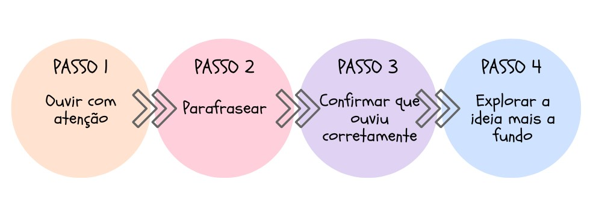

# Dominando a escuta ativa

A escuta ativa é uma técnica que traz eficiência para o diálogo, baseada na compreensão e no cuidado ao ouvir o outro. Consiste não apenas em ouvir, mas compreender e interpretar com atenção as informações recebidas, sejam elas verbais ou não-verbais. Porque o que não foi dito, ou o silêncio, também têm muito a dizer.

Bons ouvintes geralmente têm as seguintes características:

- Eles estão focados no seu interlocutor.

- Eles não estão distraídos.

- Eles têm a mente aberta e não julgam.

- Eles estão curiosos.

- Eles fazem boas perguntas.

- Eles incluem sentimentos na conversa.

- Eles aceitam perspectivas diferentes, o que significa que podem gerenciar suas próprias opiniões.

# Escuta Interna 

Algumas das barreiras que podem impedir a compreensão adequada das questões envolvidas incluem fatores físicos e culturais, como ambiente barulhento ou diferenças culturais. Há também atitudes que prejudicam enormemente a comunicação se não formos cuidadosos e que são:

 ## Sinais não verbais inadequados

Sinais não verbais inadequados incluem comportamentos tais como, como enfrentar ou se afastar da outra parte, não manter contato visual, parecer tenso ou apresentar uma postura 'fechada' cruzando os braços etc.

Por exemplo, bocejar é um desrespeito sem tamanho para com a outra parte. A faz pensar que o discurso dela é tão irrelevante que até te deu sono.

## Ser o centro das atenções (Competição)

Isso se refere à tendência que a maioria das pessoas tem de compartilhar situações similares, mudando do papel de escuta para o de fala tirando o foco da outra parte e colocando-o em si mesmo. É uma espécie de competição de quem teve a pior a semana, ou quem teve o melhor namorado etc.

## Fingir que entendeu

Se você realmente não entendeu o que a outra parte disse, você deve pedir esclarecimentos de forma direta - dizendo algo como: “Desculpe, eu não entendi isso que você falou. Poderia me dar um exemplo?” Esperar que seu significado eventualmente se torne claro não acontece como um passe de mágica e prejudica todo o processo.

## Dar conselhos sem que te peçam

Uma crença muito comum, inconsciente ou despercebida sobre estar conversando é que pensamos que estão nos procurando para que possamos resolver o problema deles. Afinal, quando outras pessoas falam conosco, devemos dar a elas uma resposta correta, uma solução para um problema ou até mesmo nossa opinião sobre o assunto. Mesmo que não nos perguntem. Não fazemos isso por mal, queremos ajudar. Somos solícitos. Mas as pessoas geralmente só querem ser ouvidas, desabafar mesmo. Assim, só dê conselhos se te pedirem por eles.

## Julgar e subestimar

Subestimar envolve perder o significado do que foi dito por que o discurso do interlocutor não está de acordo com sua própria visão de como as coisas são. E por conta disso, você considera o interlocutor uma pessoa desprovida de inteligência chegando ao cúmulo de menosprezá-la. Quando temos noções preconcebidas sobre um emissor, esses preconceitos podem interferir em nossa capacidade de ouvir com precisão e competência a mensagem do emissor. E para sermos bem sinceros, todo mundo tem ideias preconcebidas sobre uma variedade infinita de temas, mas bons ouvintes aprenderam a controlar suas opiniões enquanto ouvem.

# Escuta Crítica

Na escuta crítica começamos a perceber diferenças na fala do outro, concordando ou discordando. Este é o nível modelo em que mantemos a mente aberta e a atenção no presente, porém a compreensão do outro ainda é reduzida.

Assim, escuta crítica é o processo de examinar afirmações feitas em um discurso para avaliar sua relevância e credibilidade. Nesse contexto, significa usar pensamento e raciocínio cuidadosos e sistemáticos para ver se uma mensagem faz sentido à luz de evidências factuais. A escuta crítica pode ser aprendida com a prática, mas não é necessariamente fácil de ser posta em prática.

# Escuta Ativa

A escuta ativa é um elemento crítico na construção de relacionamentos eficazes e na promoção de uma comunicação clara e compreensiva. Ela é composta por 4 elementos:

1. "Ouvir com atenção", envolve mais do que apenas ouvir as palavras que são ditas. Requer atenção plena e foco total no emissor, o que significa evitar distrações, observar a linguagem corporal e manter contato visual. Essa concentração completa permite que o ouvinte absorva completamente a mensagem do emissor.

2. "Parafrasear", é uma forma de demonstrar que você está ouvindo ativamente. Isso envolve repetir a mensagem do emissor com suas próprias palavras, o que demonstra que você está não só ouvindo, mas também entendendo o que está sendo comunicado.

3. "Confirmar que ouviu corretamente", envolve verificar a sua compreensão com o emissor. Isso pode ser feito reiterando pontos-chave ou fazendo perguntas para esclarecer qualquer dúvida. Este passo é fundamental para garantir que você compreendeu corretamente a mensagem.

4. "Explorar a ideia mais a fundo", é o processo de aprofundar a compreensão da mensagem do emissor. Isso pode envolver fazer perguntas adicionais para obter mais informações ou discutir o tema em maior profundidade. Este passo ajuda a garantir que você tenha uma compreensão completa da mensagem e permite que o emissor compartilhe detalhes adicionais ou esclareça pontos que podem ter sido inicialmente obscuros.

E atenção! A escuta ativa é uma ótima forma de melhorar a comunicação interpessoal, mas não é necessário praticá-la a todo momento. Afinal, também é importante ter outros tipos de diálogo com os seus gerentes, subordinados diretos, colegas, amigos e parentes.

Dica

Você pode usar algumas das frases a seguir para parafrasear e confirmar se ouviu atentamente:

- “Parece que você…”

- “Tenho a sensação de que…”

- “Parece que você…”

- “É como se…”

- “Deixa eu ver se entendi, você…”

- "Então você está dizendo que ..."

# Empatia

A empatia é tanto uma habilidade natural, adquirida durante a criação e as experiências de vida, quanto pode ser aprendida.

Pessoas empáticas também conseguem formar laços de amizade e iniciar relacionamentos mais facilmente. Elas são queridas em seus círculos sociais por suas posturas solícitas e compreensivas.

Se você deseja desenvolver a sua empatia, sugerimos 2 exercícios que podem ser postos em prática já!

## Tente entender o lado do outro mesmo quando você discorda

Quando alguém discorda do que pensamos, a primeira reação costuma ser dar de ombros. Às vezes, a discordância de opiniões pode acarretar discussões. Esses conflitos acontecem porque a maioria das pessoas quer somente expressar o que pensa, desconsiderando o ponto de vista alheio.

Deste modo, tente compreender o que leva alguém a discordar de você. Avalie o que você sabe sobre essa pessoa, como se estivesse à procura de peças para um quebra-cabeça. Como a criação e as vivências dela podem ter influenciado em seu jeito de pensar? Como a personalidade dela impacta a sua mentalidade?

O objetivo desse exercício não é reconstruir os mínimos detalhes da vida do outro. O único que consegue avaliar todos os aspectos da vida de uma pessoa é o psicólogo e, para isso, são necessárias muitas trocas de informação durante consultas. A intenção é, na verdade, tentar compreender os fatores que podem ter influenciado as opiniões, os valores, as crenças e a personalidade do outro para trazer clareza sobre ele.

## Imagine-se no lugar da pessoa

Este é um exercício prático que você pode fazer com qualquer pessoa. Se imagine no lugar do outro, como se vivesse a vida dele e tivesse passado pelas mesmas experiências. Depois, se questione. O que você faria no lugar desse indivíduo? Como se comportaria se tivesse as mesmas preocupações e ansiedades?

Além de lhe fornece múltiplas perspectivas sobre a vida, esse exercício é capaz de abrandar as suas opiniões acerca das pessoas.

Por exemplo, você não se dá bem com uma pessoa difícil no trabalho. Não importa o quão cordial você seja, desentendimentos e provocações são comuns entre vocês. Os demais colegas de trabalho possuem a mesma opinião, por isso, não tentam estabelecer um vínculo com essa pessoa.

Ao fazer esse exercício com as informações que você possui sobre ela, conseguirá compreender o porquê de ela se portar com tanto mal humor. Você pode descobrir, ainda, que essa pessoa possui dificuldade para formar amizades por ser ansiosa ou por ter tido experiências ruins no passado. Assim, conseguirá ter empatia por ela.

Para essa prática funcionar direitinho, você precisa praticar a sua escuta e fazer perguntas pertinentes durante conversas para conhecer minimamente a outra pessoa.

# Comunicação Não verbal

A comunicação não verbal refere-se a todas as formas de comunicação que não envolvem a palavra falada ou escrita. É uma parte importante da interação humana, pois ela pode transmitir emoções e informações que as palavras às vezes não conseguem expressar adequadamente. Além disso, ela pode ser usada para enfatizar, contradizer ou modificar o que é dito verbalmente.

Ela é composta por elementos como gestos, expressões faciais, contato visual, postura, tom de voz, proximidade física e até mesmo a aparência pessoal.

Uma observação importante é que os significados dos sinais não verbais podem variar bastante entre diferentes culturas e contextos, por isso é essencial ter sensibilidade cultural e consciência contextual ao interpretar esse tipo de comunicação.

# Midfulness

"Mindfulness" é uma prática de atenção plena que tem raízes em tradições de meditação budistas, mas que foi adaptada para uma variedade de contextos modernos, incluindo psicologia, saúde mental e bem-estar pessoal.

A ideia principal por trás do "Mindfulness" é focar a atenção intencionalmente no momento presente, sem julgamento. Isso significa que você se torna totalmente consciente de seus pensamentos, emoções, sensações físicas e ambiente ao seu redor, mas tenta observar esses aspectos sem julgá-los como bons ou ruins.

Existem várias técnicas de "Mindfulness" que você pode usar e neste exercício sugerimos:

- Mindfulness durante as atividades diárias: Você pode praticar a atenção plena durante atividades cotidianas como comer, tomar banho, ou escovar os dentes. O objetivo é estar plenamente presente na atividade, em vez de deixar sua mente divagar.

