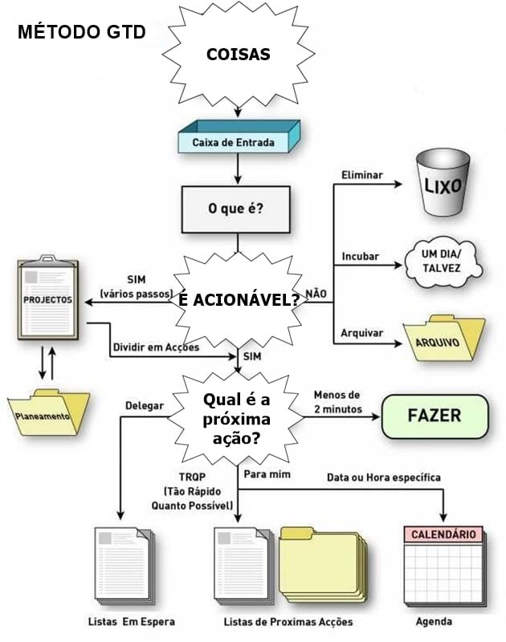
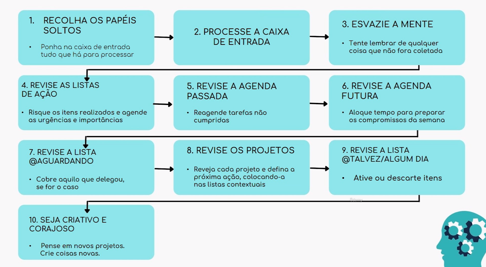

# O Guia COMPLETO para Alta Produtividade + 4 Cursos Extras

## Técnica GTD - Getting Things Done

- A produtividade está ligada a clareza do caminho que pessoa busca: "Primeiro tenha clareza sobre onde quer chegar. Depois, invista a maior parte dos seus esforços apenas em coisas que irão te levar para mais perto deste lugar onde você quer estar".

- A definição de metas intermediárias facilita a fluidez dos projetos.

- Colecionar as tarefas intermediárias em um gŕafico com os eixos complexidade x valor. Ao fazer isso, deve-se buscar organizar a execução das mesmas atacando as tarefas de menor complexidade e maior valor. Em sequência, as de alta complexidade e alto valor. Com essa etapa finalizada, ataca-se as de baixo valor e baixa complexidade para por fim, atacar as de alta complexidade e baixo valor.